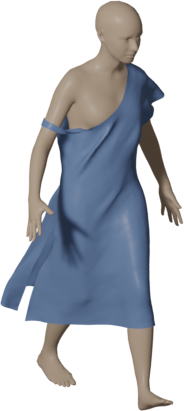
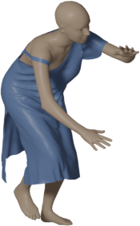
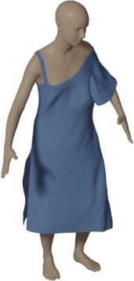
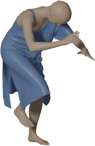

# MSAGNet: Multi-Scale Attention Graph Networks for Self-Collision-Aware Garment Dynamics Simulation

> Built upon [HOOD](https://github.com/isantesteban/HOOD) (Grigorev et al., CVPR 2023).
> Our improvements: attention-based message aggregation, self-collision penalty loss,
> and hierarchical graph with self-collision edges.

### Install conda enviroment
We provide a conda environment file `hood.yml` to install all the dependencies. 
You can create and activate the environment with the following commands:

```bash
conda env create -f hood.yml
conda activate hood
```

If you want to build the environment from scratch, here are the necessary commands: 
<details>
  <summary>Build enviroment from scratch</summary>

```bash
# Create and activate a new environment
conda create -n hood python=3.9 -y
conda activate hood

# install pytorch (see https://pytorch.org/)
conda install pytorch torchvision torchaudio pytorch-cuda=11.7 -c pytorch -c nvidia -y

# install pytorch_geometric (see https://pytorch-geometric.readthedocs.io/en/latest/install/installation.html)
conda install pyg -c pyg -y

# install pytorch3d (see https://github.com/facebookresearch/pytorch3d/blob/main/INSTALL.md)
conda install -c fvcore -c iopath -c conda-forge fvcore iopath -y
conda install -c bottler nvidiacub -y
conda install pytorch3d -c pytorch3d -y


# install auxiliary packages with conda
conda install -c conda-forge munch pandas tqdm omegaconf matplotlib einops ffmpeg -y

# install more auxiliary packages with pip
pip install smplx aitviewer chumpy huepy

# create a new kernel for jupyter notebook
conda install ipykernel -y; python -m ipykernel install --user --name hood --display-name "hood"
```
</details>

### Download data
#### Data archive
Download the pre-packaged data archive from Baidu Netdisk (see bottom of this README).
Unpack it anywhere and set the `HOOD_DATA` environmental variable to the unpacked folder.
Also, set the `HOOD_PROJECT` environmental variable to this repository's root:

```bash
export HOOD_DATA=/path/to/hood_data
export HOOD_PROJECT=/path/to/this/repository
```

The archive includes all files listed in the directory structure below,
**except SMPL body models** (see next section).

#### SMPL models
Download the SMPL models using this [link](https://smpl.is.tue.mpg.de/). Unpack them into the `$HOOD_DATA/aux_data/smpl` folder.

#### Data redistribution note

The Baidu Netdisk archive (see bottom of this README) contains all files listed in the
directory structure above **except the SMPL body models**, which must be downloaded
separately due to license restrictions.

The archive includes:
- Garment meshes, garment dictionary, SMPL auxiliary data, data splits,
  pre-trained weights (including MSAGNet models `postcvpror.pth` and
  `cvpr_submissionor.pth`), pre-converted VTO training sequences, and demo data.

The following must be downloaded separately:

| Resource | URL | License |
|---|---|---|
| SMPL body models | [smpl.is.tue.mpg.de](https://smpl.is.tue.mpg.de/) | SMPL License (non-commercial) |
| AMASS (CMU subset) | [amass.is.tue.mpg.de](https://amass.is.tue.mpg.de/) | AMASS License |
| VTO dataset | [github.com/isantesteban/vto-dataset](https://github.com/isantesteban/vto-dataset) | MIT |
| Validation sequences | [Google Drive](https://drive.google.com/file/d/1jFkDWPZW2HwYsYqcXAC3hX0NlumBnqT3/view) | HOOD License |

In the end your `$HOOD_DATA` folder should look like this(严格按照要求完成文件夹):
```
$HOOD_DATA
    |-- aux_data
        |-- datasplits // directory with csv data splits used for training the model
        |-- smpl // directory with smpl models
            |-- SMPL_NEUTRAL.pkl
            |-- SMPL_FEMALE.pkl
            |-- SMPL_MALE.pkl
        |-- garment_meshes // folder with .obj meshes for garments used in HOOD
        |-- garments_dict.pkl // dictionary with garmentmeshes and their auxilliary data used for training and inference
        |-- smpl_aux.pkl // dictionary with indices of SMPL vertices that correspond to hands, used to disable hands during inference to avoid body self-intersections
    |-- trained_models // directory with trained models
        |-- cvpr_submission.pth // HOOD CVPR model (baseline)
        |-- postcvpr.pth // HOOD post-CVPR model (baseline)
        |-- fine15.pth // Fine15 baseline (15 message-passing steps, no long-range edges)
        |-- fine48.pth // Fine48 baseline (48 message-passing steps, no long-range edges)
        |-- postcvpror.pth // MSAGNet (ours) -- with attention + self-collision loss
        |-- cvpr_submissionor.pth // MSAGNet (ours) -- CVPR-configuration variant
        |-- fromanypose // demo data for inference from arbitrary pose
        |-- temp // pre-packaged AMASS demo sequences
```

## Inference
The jupyter notebook [Inference.ipynb](Inference.ipynb) contains an example of how to run inference of a trained HOOD model given a garment and a pose sequence.

It also has examples of such use-cases as adding a new garment from an .obj file and converting sequences from [AMASS](https://amass.is.tue.mpg.de/) and [VTO](https://github.com/isantesteban/vto-dataset) datasets to the format used in HOOD.

To run inference starting from arbitrary garment pose and arbitrary mesh sequence refer to the [InferenceFromMeshSequence.ipynb](InferenceFromMeshSequence.ipynb) notebook.

To use our MSAGNet model instead of the HOOD baseline, change the checkpoint path
in the notebook to `trained_models/postcvpror.pth`.  

## Training
To train a new HOOD model from scratch, you need to first download the [VTO](https://github.com/isantesteban/vto-dataset) dataset and convert it to our format.

You can find the instructions on how to do that and the commands used to start the training in the [Training.ipynb](Training.ipynb) notebook.

## Validation Sequences
You can download the sequences used for validation (Table 1 in the main paper and Tables 1 and 2 in the Supplementary) 
using [this link](https://drive.google.com/file/d/1jFkDWPZW2HwYsYqcXAC3hX0NlumBnqT3/view?usp=sharing)

You can find instructions on how to generate validation sequences and compute metrics over them in the [ValidationSequences.ipynb](ValidationSequences.ipynb) notebook.

## Qualitative results






Run `Inference.ipynb` with the provided weights, then render with `utils/show.py` or Blender.

## What's included

**Model weights:** Pre-trained weights are provided in `trained_models/`,
including `postcvpror.pth` and `cvpr_submissionor.pth`.

**Collision loss:** A modified collision loss with external penetration and
self-collision penalty terms is implemented in `collision_penalty.py`.
See commented sections for the self-collision formulation.

**Evaluation:** `评价指标.ipynb` provides per-vertex MPVE and collision count
computation between OBJ meshes.

## Reproducing results

| Paper result | Corresponding file |
|---|---|
| Table 1 (collision metrics) | `评价指标.ipynb` |
| Table 2 (MPVE) | `评价指标.ipynb` |
| Fig 4–7 (qualitative) | `Inference.ipynb` + `utils/show.py` |
| Ablation (Fine15/48) | `configs/cvpr_baselines/` |

**Qualitative results:** Run `Inference.ipynb` with the provided weights,
then render with `utils/show.py` or Blender.

**Quantitative evaluation:** Use `评价指标.ipynb` to compute per-vertex error
and collision metrics between generated and reference meshes.

**Ablation baselines:** Configurations in `configs/cvpr_baselines/`.

## Baidu Netdisk

https://pan.baidu.com/s/1aMCNoQaf6KKxgByDstuM5w  (提取码: 5r9h)


